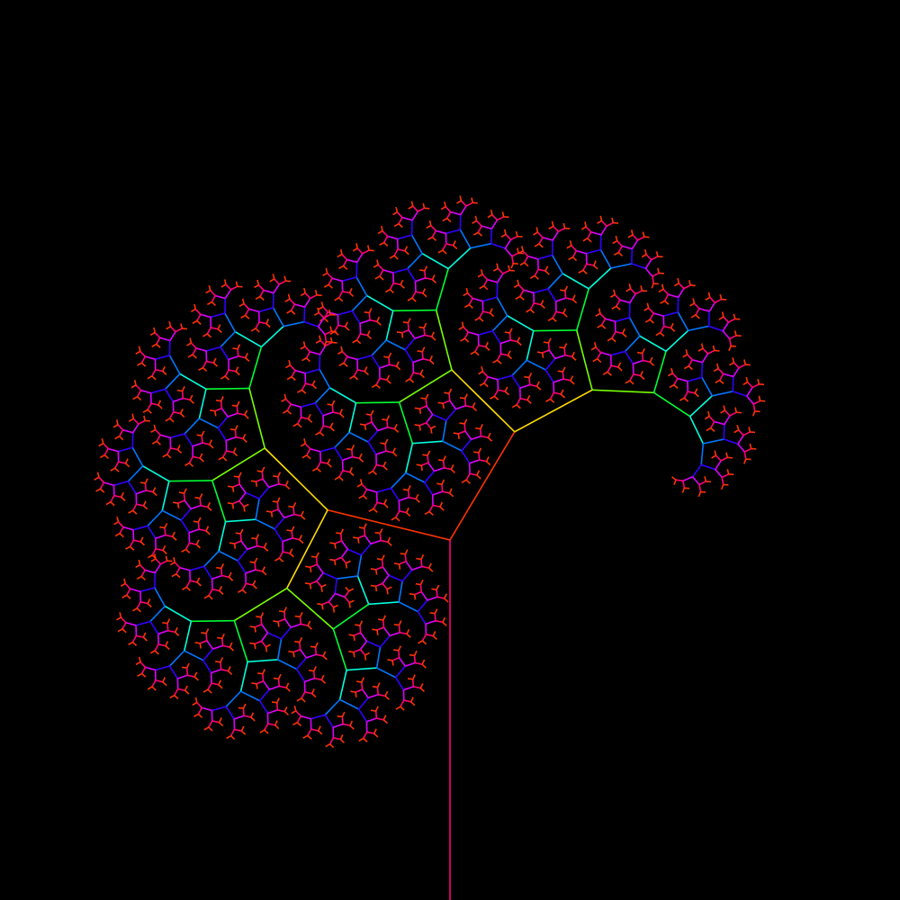

# fractal-tree

Experimente diretamente no navegador

<https://thiagomaxpavao.github.io/fractal-tree/>

## Funcionamento e **Controles**

A árvore é gerada recursivamente:

O tronco principal se divide em dois galhos, cada um deles faz um ângulo θ1 e θ2 com a direção original do tronco.

Cada um desses galhos serve como tronco para dois novos galhos, que também fazem os mesmos ângulos θ1 e θ2 com a direção do 'novo' tronco.

O valor dos ângulos é definido pela **posição do mouse** na tela, a posição *x* do mouse define o ângulo do galho direito, enquanto a posição *y* define o ângulo do galho esquerdo.

O tamanho de cada novo galho é 0.7 vezes o anterior. E o limite para quantos galhos são desenhados pela lógica recursiva pode ser alterado girando o **scroll do mouse**.

Também é possível acessar o modo colorido, para alternar entre ele e o modo preto e branco basta clicar no **botão esquerdo do mouse**.

## Exemplo

